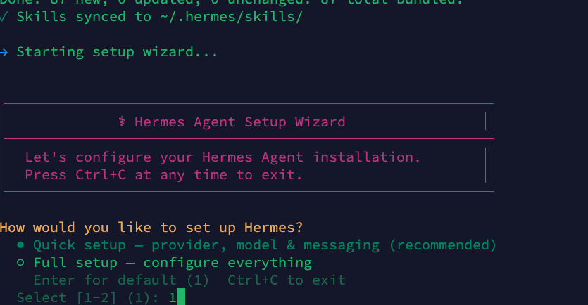
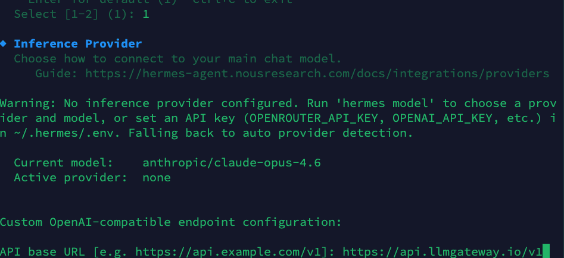
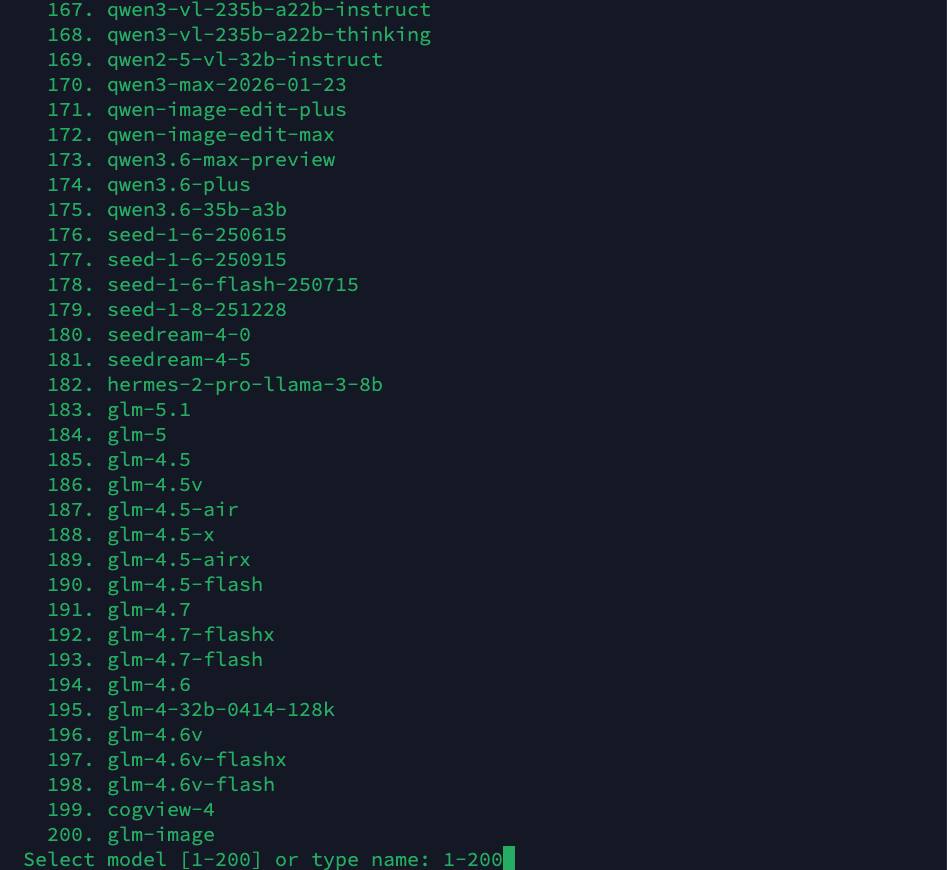
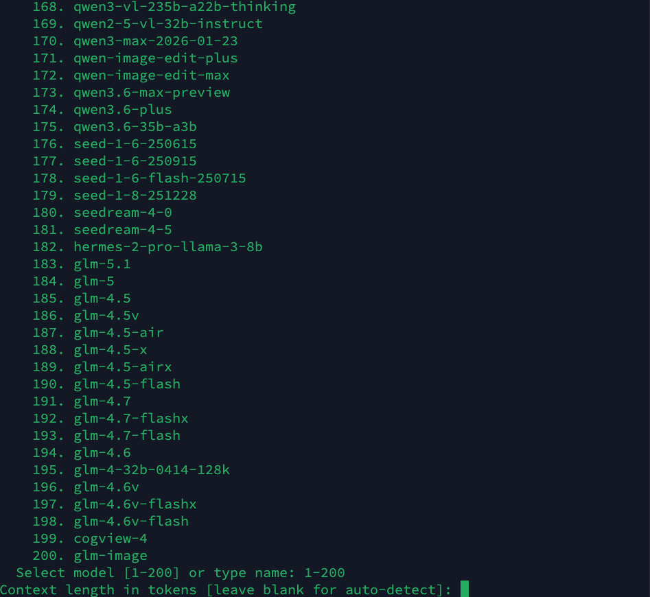
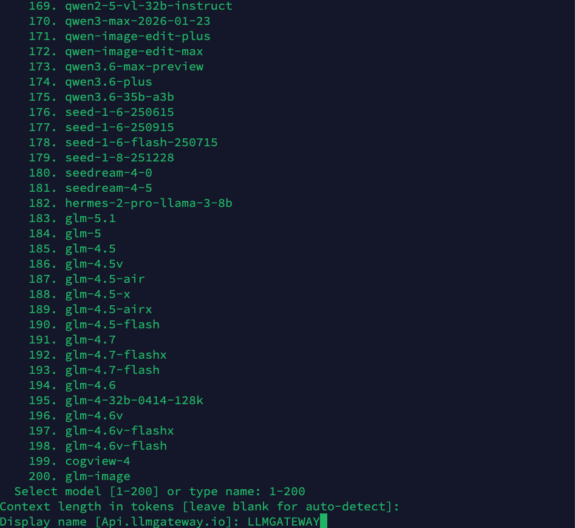
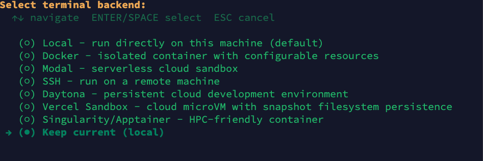
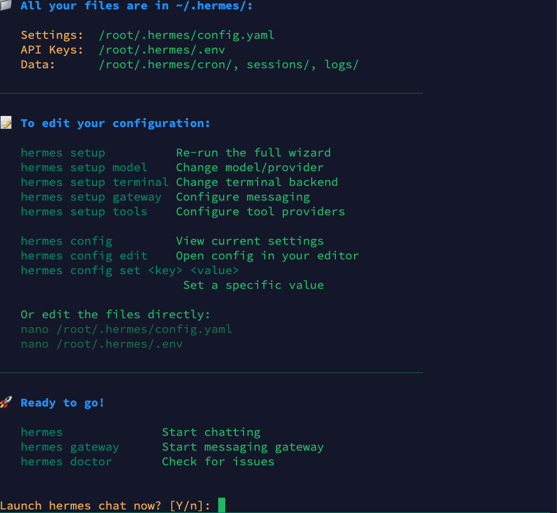
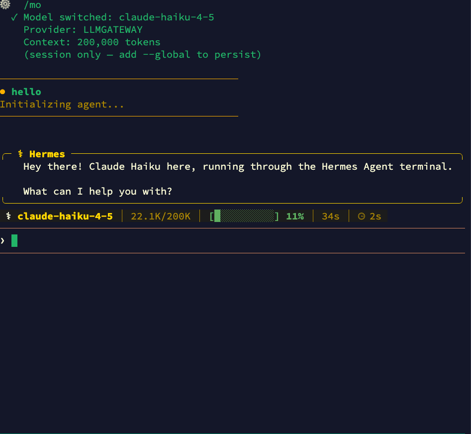
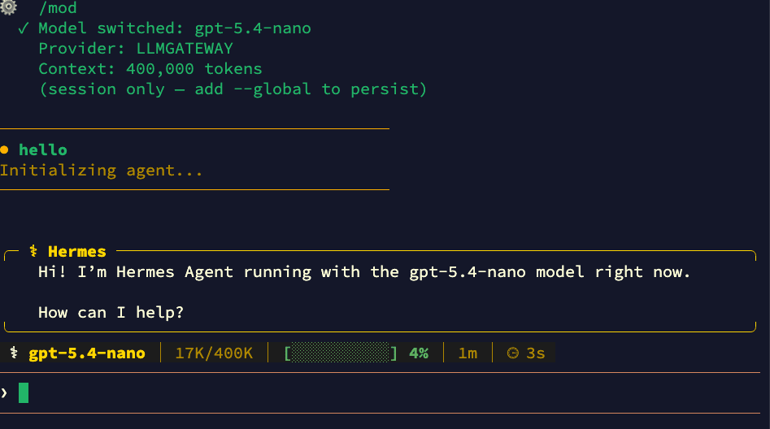

import { Step, Steps } from "fumadocs-ui/components/steps";
import { Callout } from "fumadocs-ui/components/callout";

[Hermes Agent](https://github.com/nousresearch/hermes-agent) is an open-source AI coding agent for your terminal built by Nous Research. It supports tool use, browser automation, multi-provider routing, skills, and MCP servers. By pointing it at LLM Gateway you get access to 210+ models from 60+ providers, all tracked in one dashboard.

One config change. No code changes. Full cost tracking.

## Prerequisites

- Hermes Agent installed — see [installation](#installation) below or visit the [Hermes Agent repo](https://github.com/nousresearch/hermes-agent)
- An LLM Gateway API key — [sign up free](https://llmgateway.io/signup) (no credit card required)

## Installation

Install Hermes Agent using the official install script:

```bash
curl -fsSL https://raw.githubusercontent.com/NousResearch/hermes-agent/main/scripts/install.sh | bash
```

After installation, reload your shell and verify:

```bash
source ~/.bashrc
hermes --version
```

<Callout type="info">
	The installer handles Python 3.11, Node.js, ripgrep, and other dependencies
	automatically. See the [repo](https://github.com/nousresearch/hermes-agent)
	for Windows (PowerShell) and manual install options.
</Callout>

## Setup

<Steps>
<Step>
### Run the Setup Wizard

Run `hermes setup` to launch the interactive setup wizard. Select **Quick setup** (option 1) for the fastest configuration:

```bash
hermes setup
```



</Step>

<Step>
### Configure Inference Provider

The wizard will ask you to configure your inference provider. Select **Custom OpenAI-compatible endpoint** and enter the LLM Gateway base URL:

```
API base URL: https://api.llmgateway.io/v1
```

Then paste your LLM Gateway API key (starts with `llmgtwy_`):



</Step>

<Step>
### Choose a Model

The wizard presents a list of 200+ available models. Type a model name or select from the list. Popular choices include `claude-sonnet-4-5`, `gpt-4o`, or `gemini-2.5-pro`:



</Step>

<Step>
### Set Context Length

Leave the context length blank to auto-detect (recommended), or specify a custom value:



</Step>

<Step>
### Set Display Name

Give your provider configuration a display name. This appears in the Hermes status bar when chatting:



</Step>

<Step>
### Select Terminal Backend

Choose your terminal backend. **Keep current (local)** is the default and recommended for most users:



</Step>

<Step>
### Setup Complete

Once done, Hermes shows you where your config files are stored and how to edit them. Press `Y` to launch a chat session:



Your configuration files:

- **Settings:** `~/.hermes/config.yaml`
- **API Keys:** `~/.hermes/.env`
- **Data:** `~/.hermes/cron/`, `sessions/`, `logs/`

</Step>
</Steps>

## Using Hermes with LLM Gateway

Once configured, all requests route through LLM Gateway. You'll see the provider name (e.g., "LLMGATEWAY") in the Hermes status bar.

### Switching Models at Runtime

Use the `/mo` or `/mod` slash command inside a chat session to switch models on the fly:



You can switch to any model available through LLM Gateway — from Claude to GPT to open-source models:



Add `--global` to persist the model change across sessions.

### CLI Model Override

You can also override the model from the command line:

```bash
# Use a specific model for this session
hermes chat --model gpt-4o-mini

# Use a powerful model for complex tasks
hermes chat --model claude-opus-4-7
```

## Why Use LLM Gateway with Hermes Agent

- **210+ models** — Claude, GPT, Gemini, Llama, DeepSeek, and more
- **One API key** — Stop managing separate keys for each provider
- **Cost tracking** — See exactly what each session costs in your dashboard
- **Response caching** — Repeated requests hit cache automatically
- **Automatic fallback** — If a provider is down, requests route to an alternative
- **Volume discounts** — Check [discounted models](https://llmgateway.io/models?discounted=true) for savings up to 90%

## Configuration Reference

### Config File

The setup wizard writes to `~/.hermes/config.yaml`. The relevant section for LLM Gateway:

```yaml
model:
  default: "claude-sonnet-4-5"
  provider: "custom"
  api_key: "llmgtwy_your-api-key-here"
  base_url: "https://api.llmgateway.io/v1"
```

<Callout type="info">
	The `base_url` overrides provider routing — Hermes will call the LLM Gateway
	endpoint directly using the provided `api_key`.
</Callout>

### Using Environment Variables

Instead of putting your key in the config file, add it to `~/.hermes/.env`:

```bash
OPENAI_API_KEY=llmgtwy_your-api-key-here
OPENAI_BASE_URL=https://api.llmgateway.io/v1
```

Then your `~/.hermes/config.yaml` only needs:

```yaml
model:
  default: "claude-sonnet-4-5"
  provider: "custom"
```

<Callout type="info">
	Configuration precedence (highest to lowest): CLI flags &gt;
	`~/.hermes/config.yaml` &gt; `~/.hermes/.env` &gt; built-in defaults.
</Callout>

### One-Shot Mode

For scripting or CI pipelines, use the `-q` flag for a one-shot prompt:

```bash
hermes chat -q "Explain what this function does" -Q
```

The `-Q` flag enables quiet mode, suppressing the banner and spinner for clean output. For pure one-shot mode (no interactive session):

```bash
hermes chat -z "Generate a README for this project"
```

## Useful Hermes Commands

| Command                | Purpose                                 |
| ---------------------- | --------------------------------------- |
| `hermes`               | Start interactive chat (default)        |
| `hermes setup`         | Run the setup wizard                    |
| `hermes setup model`   | Change model/provider                   |
| `hermes chat -q "..."` | One-shot prompt                         |
| `hermes model`         | Choose provider and model interactively |
| `hermes config edit`   | Open config in your editor              |
| `hermes doctor`        | Diagnose connection/config issues       |
| `hermes sessions`      | Browse and manage past sessions         |
| `hermes --continue`    | Resume most recent session              |
| `hermes update`        | Update to latest version                |

## Locking to a Specific Provider

By default, LLM Gateway automatically fails over to alternative providers if your chosen provider is experiencing downtime. To disable fallback and always route to one provider, you can add the header via Hermes's request configuration.

<Callout type="warn">
	Disabling fallback means requests will fail if the chosen provider is down.
	See the [routing docs](/docs/features/routing) for details.
</Callout>

## Troubleshooting

### Model not found

If you get a "model not supported" error, check that your model ID matches exactly what's listed on the [models page](https://llmgateway.io/models). Model IDs are case-sensitive.

### Connection timeout

Verify your `base_url` is set to `https://api.llmgateway.io/v1` (note the `/v1` at the end). You can also check the `HERMES_API_TIMEOUT` environment variable if you're hitting timeouts on long-running requests.

### Authentication errors

Make sure your `api_key` starts with `llmgtwy_` and is valid. Check your [dashboard](https://llmgateway.io/dashboard) to confirm the key is active.

### Diagnosing issues

Run `hermes doctor` to check your configuration, connectivity, and credentials:

```bash
hermes doctor
```

### Old config overrides

If you previously used a different provider (e.g., OpenRouter), make sure to update both `provider` and `base_url` fields. The `provider` must be set to `"custom"` for LLM Gateway. Also check `~/.hermes/.env` for any leftover `OPENROUTER_API_KEY` or other provider keys that might take precedence.

<Callout type="info">
	View all available models on the [models page](https://llmgateway.io/models).
</Callout>

<Callout type="info">
	Need help? Join our [Discord community](https://llmgateway.io/discord) for
	support and troubleshooting assistance.
</Callout>
